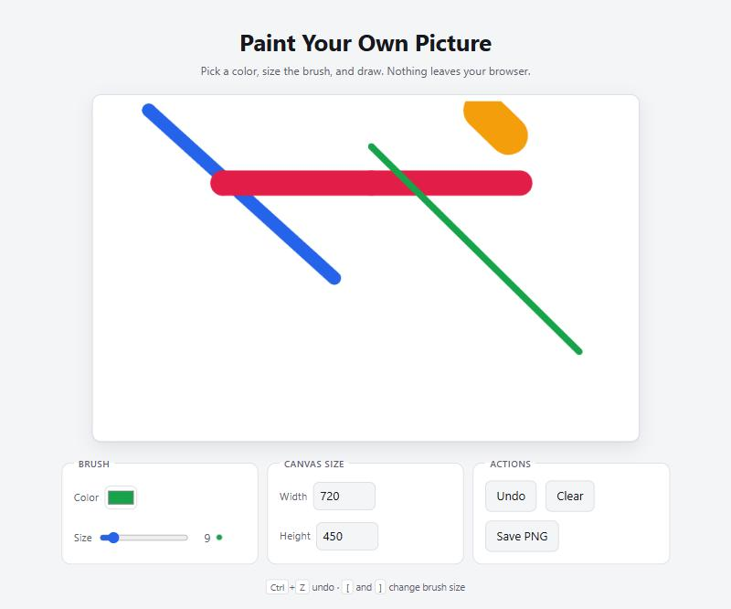

# Canvas Paint

A small freehand painting tool built on the HTML `<canvas>` element. Pick a
color, size the brush, draw. No build step, no dependencies, no network calls —
three files and a browser.

**[Try it →](https://brian7952002.github.io/canvas-paint/)**



## Run it

It's live at
[brian7952002.github.io/canvas-paint](https://brian7952002.github.io/canvas-paint/).

To run it locally, open `index.html` in a browser. That's the whole setup.

If you'd rather serve it over HTTP (handy for testing on a phone on the same
network):

```bash
npx serve .
```

## What it does

- **Freehand brush** with a color picker and a 1–80px size slider, showing a
  live preview of the current brush.
- **Smooth strokes.** Points are joined with round-capped line segments, so a
  fast drag draws a continuous line instead of a trail of separate dots.
- **Undo** the last 24 actions, via the button or <kbd>Ctrl</kbd>/<kbd>Cmd</kbd>+<kbd>Z</kbd>.
  Clearing and resizing are undoable too.
- **Resizable canvas.** Changing the width or height keeps whatever you've
  already drawn, anchored at the top-left.
- **Save as PNG**, named with the current date.
- **Works with mouse, touch, and pen** via pointer events.
- **Sharp on high-DPI screens** — the backing store is scaled by
  `devicePixelRatio` while drawing coordinates stay in CSS pixels.
- Responsive layout, keyboard-focusable controls, and a dark theme that follows
  your system setting.

### Keyboard shortcuts

| Key | Action |
| --- | --- |
| <kbd>Ctrl</kbd>/<kbd>Cmd</kbd>+<kbd>Z</kbd> | Undo |
| <kbd>[</kbd> / <kbd>]</kbd> | Decrease / increase brush size |

## How it's put together

| File | Role |
| --- | --- |
| `index.html` | Markup and controls |
| `style.css` | Layout and theming, driven by CSS custom properties |
| `script.js` | All behavior, in one IIFE with no globals |

A few decisions worth noting:

- **Pointer capture.** On `pointerdown` the canvas captures the pointer, so
  releasing the button outside the canvas still ends the stroke — without it,
  the brush stays "down" and resumes painting when the cursor returns.
- **Coordinates from `getBoundingClientRect`,** scaled by the ratio between the
  canvas's logical size and its rendered size. This keeps strokes under the
  cursor even when CSS shrinks the canvas to fit a narrow screen, which
  `offsetX`/`offsetY` alone does not.
- **The border lives on a wrapper,** not the canvas, so the element's bounding
  rect maps 1:1 onto drawing coordinates.
- **Undo stores `ImageData` snapshots** taken before each change. Simple and
  exact; capped at 24 entries to bound memory.

## Known limitations

- Drawing requires a pointing device — there's no keyboard drawing mode.
- Undo history is in memory only and resets on reload.
- Resizing the canvas crops artwork rather than scaling it, if you size down.
- One brush, no eraser, no layers. It's a toy, deliberately.

## License

[MIT](LICENSE)
